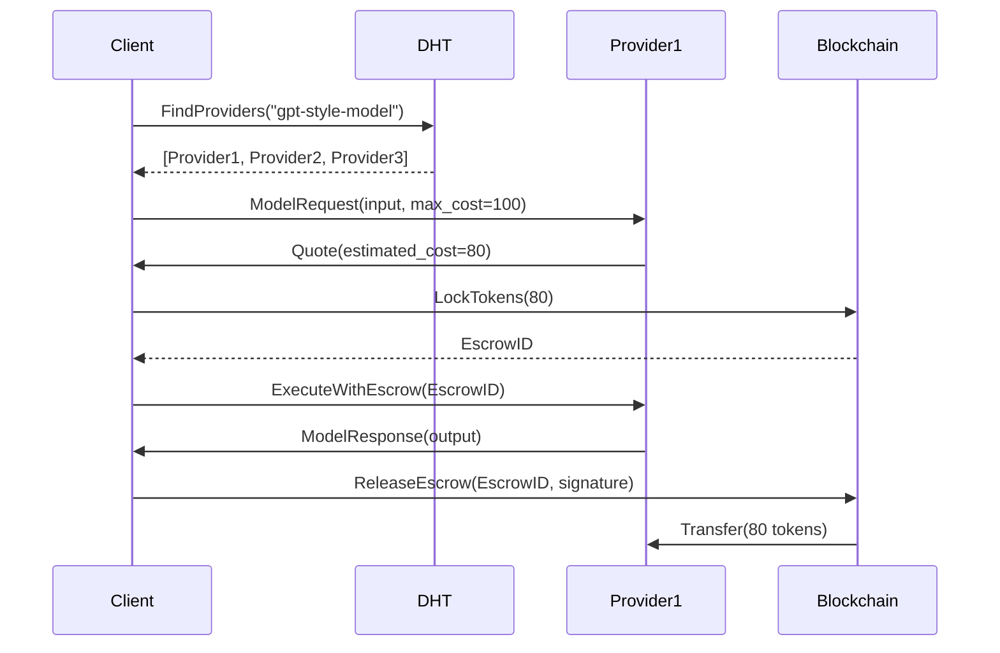

# Aurora P2P & Blockchain Architecture

## 📋 Índice
1. [Visión General](#visión-general)
2. [Arquitectura P2P](#arquitectura-p2p)
3. [Sistema Blockchain](#sistema-blockchain)
4. [Tokenomics](#tokenomics)
5. [Plan de Implementación](#plan-de-implementación)

---

## 🎯 Visión General

Aurora combina networking P2P descentralizado con blockchain para crear una economía de IA donde:
- **Usuarios** pueden ejecutar y consumir modelos de IA pagando con tokens
- **Proveedores** ofrecen compute y ganan tokens por inferencias
- **Desarrolladores** publican modelos y reciben regalías
- **Validadores** aseguran la calidad y ganan recompensas

---

## 🌐 Arquitectura P2P

### 1. **Stack Tecnológico**

```rust
libp2p (Rust) → WASM → Browser
├── Transport: WebRTC + WebSockets
├── Protocol: Gossipsub + Kademlia DHT
├── Identity: DIDs con ECDSA P-256
└── Discovery: mDNS + Bootstrap nodes
```

### 2. **Componentes P2P**

#### **A. Network Layer**
```rust
pub struct P2PNetwork {
    swarm: Swarm<AuroraBehaviour>,
    peer_id: PeerId,
    dht: Kademlia<MemoryStore>,
    gossipsub: Gossipsub,
    relay_nodes: Vec<Multiaddr>,
}
```

**Funcionalidades:**
- ✅ Peer discovery automático
- ✅ NAT traversal con relay nodes
- ✅ Connection pooling
- ✅ Bandwidth management

#### **B. Message Protocol**

```rust
#[derive(Serialize, Deserialize)]
pub enum AuroraMessage {
    // Discovery
    PeerAnnounce { did: String, capabilities: Vec<String> },
    
    // AI Model Request/Response
    ModelRequest { model_id: String, input: Vec<u8>, max_cost: u64 },
    ModelResponse { request_id: String, output: Vec<u8>, cost: u64 },
    
    // Payment
    PaymentProof { tx_hash: String, amount: u64, signature: Vec<u8> },
    
    // Reputation
    FeedbackSubmit { peer_id: String, rating: u8, signature: Vec<u8> },
}
```

#### **C. Peer Types**

1. **Client Peers** (Browsers)
   - Consume AI services
   - Pay with tokens
   - Submit feedback

2. **Provider Peers** (Servers)
   - Host AI models
   - Provide compute
   - Earn tokens

3. **Relay Peers** (Infrastructure)
   - Help with NAT traversal
   - Maintain network connectivity
   - Get small fees

4. **Bootstrap Peers** (Initial nodes)
   - Entry points to network
   - DHT seeds
   - Always online

### 3. **Discovery Mechanism**

```
User connects → Bootstrap node → DHT query → Find peers with capabilities
                                              ↓
                                     Gossipsub subscribe to topics:
                                     - /aurora/models/discovery
                                     - /aurora/payments
                                     - /aurora/reputation
```

### 4. **Session Flow**



---

## ⛓️ Sistema Blockchain

### 1. **Blockchain Choice: Polygon (Layer 2)**

**¿Por qué Polygon?**
- ✅ Low gas fees (~$0.001 per transaction)
- ✅ Fast confirmations (~2 seconds)
- ✅ EVM compatible (Solidity)
- ✅ Existing ecosystem y herramientas
- ✅ Bridge a Ethereum para liquidez

**Alternativas consideradas:**
- Solana: Más rápido pero menos tooling
- Arbitrum: Similar pero Polygon tiene más adopción
- Custom blockchain: Demasiado trabajo inicial

### 2. **Smart Contracts**

#### **A. Aurora Token Contract (ERC-20)**

```solidity
// SPDX-License-Identifier: MIT
pragma solidity ^0.8.20;

import "@openzeppelin/contracts/token/ERC20/ERC20.sol";
import "@openzeppelin/contracts/access/Ownable.sol";

contract AuroraToken is ERC20, Ownable {
    // Token details
    string public constant NAME = "Aurora AI Token";
    string public constant SYMBOL = "AURA";
    uint8 public constant DECIMALS = 18;
    uint256 public constant INITIAL_SUPPLY = 1_000_000_000 * 10**18; // 1B tokens
    
    // Distribution
    uint256 public constant TEAM_ALLOCATION = 15; // 15%
    uint256 public constant COMMUNITY_ALLOCATION = 35; // 35%
    uint256 public constant ECOSYSTEM_ALLOCATION = 30; // 30%
    uint256 public constant LIQUIDITY_ALLOCATION = 20; // 20%
    
    constructor() ERC20(NAME, SYMBOL) {
        _mint(msg.sender, INITIAL_SUPPLY);
    }
    
    // Burn mechanism for deflation
    function burn(uint256 amount) external {
        _burn(msg.sender, amount);
    }
}
```

#### **B. Payment Escrow Contract**

```solidity
contract AuroraEscrow {
    struct Escrow {
        address client;
        address provider;
        uint256 amount;
        bytes32 requestHash;
        uint256 createdAt;
        EscrowStatus status;
    }
    
    enum EscrowStatus { Pending, Completed, Disputed, Refunded }
    
    mapping(bytes32 => Escrow) public escrows;
    
    event EscrowCreated(bytes32 indexed escrowId, address client, uint256 amount);
    event EscrowReleased(bytes32 indexed escrowId, address provider, uint256 amount);
    event EscrowDisputed(bytes32 indexed escrowId);
    
    function createEscrow(
        address _provider,
        bytes32 _requestHash
    ) external payable returns (bytes32) {
        require(msg.value > 0, "Amount must be > 0");
        
        bytes32 escrowId = keccak256(abi.encodePacked(
            msg.sender,
            _provider,
            _requestHash,
            block.timestamp
        ));
        
        escrows[escrowId] = Escrow({
            client: msg.sender,
            provider: _provider,
            amount: msg.value,
            requestHash: _requestHash,
            createdAt: block.timestamp,
            status: EscrowStatus.Pending
        });
        
        emit EscrowCreated(escrowId, msg.sender, msg.value);
        return escrowId;
    }
    
    function releaseEscrow(
        bytes32 _escrowId,
        bytes memory _signature
    ) external {
        Escrow storage escrow = escrows[_escrowId];
        require(escrow.status == EscrowStatus.Pending, "Invalid status");
        require(msg.sender == escrow.client, "Not authorized");
        
        // Verify signature from provider
        require(verifyProviderSignature(_escrowId, _signature, escrow.provider), "Invalid signature");
        
        escrow.status = EscrowStatus.Completed;
        payable(escrow.provider).transfer(escrow.amount);
        
        emit EscrowReleased(_escrowId, escrow.provider, escrow.amount);
    }
    
    function disputeEscrow(bytes32 _escrowId) external {
        Escrow storage escrow = escrows[_escrowId];
        require(msg.sender == escrow.client || msg.sender == escrow.provider, "Not authorized");
        require(escrow.status == EscrowStatus.Pending, "Invalid status");
        
        escrow.status = EscrowStatus.Disputed;
        emit EscrowDisputed(_escrowId);
        
        // Dispute resolution handled by arbitration contract
    }
}
```

#### **C. Model Registry Contract**

```solidity
contract AuroraModelRegistry {
    struct Model {
        bytes32 modelId;
        address owner;
        string metadataURI; // IPFS link
        uint256 basePrice; // Price per inference
        uint256 totalInferences;
        uint256 averageRating;
        bool active;
    }
    
    mapping(bytes32 => Model) public models;
    mapping(address => bytes32[]) public ownerModels;
    
    event ModelRegistered(bytes32 indexed modelId, address owner, uint256 basePrice);
    event ModelUpdated(bytes32 indexed modelId, uint256 newPrice);
    event InferenceRecorded(bytes32 indexed modelId, uint256 cost);
    
    function registerModel(
        string memory _name,
        string memory _metadataURI,
        uint256 _basePrice
    ) external returns (bytes32) {
        bytes32 modelId = keccak256(abi.encodePacked(_name, msg.sender, block.timestamp));
        
        models[modelId] = Model({
            modelId: modelId,
            owner: msg.sender,
            metadataURI: _metadataURI,
            basePrice: _basePrice,
            totalInferences: 0,
            averageRating: 0,
            active: true
        });
        
        ownerModels[msg.sender].push(modelId);
        
        emit ModelRegistered(modelId, msg.sender, _basePrice);
        return modelId;
    }
    
    function recordInference(bytes32 _modelId, uint256 _cost) external {
        Model storage model = models[_modelId];
        require(model.active, "Model not active");
        
        model.totalInferences++;
        emit InferenceRecorded(_modelId, _cost);
    }
}
```

#### **D. Reputation Contract**

```solidity
contract AuroraReputation {
    struct Feedback {
        address reviewer;
        uint8 rating; // 1-5
        string comment;
        uint256 timestamp;
    }
    
    mapping(address => uint256) public reputationScore;
    mapping(address => Feedback[]) public feedbackHistory;
    mapping(address => uint256) public totalReviews;
    
    event FeedbackSubmitted(address indexed target, address reviewer, uint8 rating);
    
    function submitFeedback(
        address _target,
        uint8 _rating,
        string memory _comment,
        bytes32 _txHash // Proof of completed transaction
    ) external {
        require(_rating >= 1 && _rating <= 5, "Rating must be 1-5");
        require(verifyTransaction(_txHash, msg.sender, _target), "Invalid transaction");
        
        feedbackHistory[_target].push(Feedback({
            reviewer: msg.sender,
            rating: _rating,
            comment: _comment,
            timestamp: block.timestamp
        }));
        
        totalReviews[_target]++;
        reputationScore[_target] = calculateReputation(_target);
        
        emit FeedbackSubmitted(_target, msg.sender, _rating);
    }
    
    function calculateReputation(address _peer) internal view returns (uint256) {
        if (totalReviews[_peer] == 0) return 0;
        
        uint256 sum = 0;
        Feedback[] storage feedbacks = feedbackHistory[_peer];
        
        for (uint i = 0; i < feedbacks.length; i++) {
            sum += feedbacks[i].rating;
        }
        
        return (sum * 100) / totalReviews[_peer]; // Score out of 500
    }
    
    function getReputation(address _peer) external view returns (uint256 score, uint256 reviews) {
        return (reputationScore[_peer], totalReviews[_peer]);
    }
}
```

---

## 💰 Tokenomics: Sistema Tri-Token

### 🎯 Filosofía del Sistema

Aurora implementa **tres tokens complementarios**, cada uno con su política monetaria y propósito específico, reflejando los tres pilares del ecosistema:

```
△ MERIT  → Infraestructura y Confiabilidad
○ MIND   → Contribución Intelectual y Computacional  
U TRUST  → Vínculos Humanos y Cooperación
```

---

### 1. **△ MERIT - Token de Infraestructura**

#### **Propósito**
Recompensa la **confiabilidad y disponibilidad** de la infraestructura P2P:
- Nodos relay activos
- Proveedores de compute estables
- Uptime superior al 99%
- Ancho de banda compartido

#### **Política Monetaria: Híbrida (Supply Inicial + Emisión Controlada)**

```solidity
contract MeritToken is ERC20 {
    // Supply Genesis
    uint256 public constant GENESIS_SUPPLY = 500_000_000 * 10**18; // 500M
    uint256 public constant MAX_SUPPLY = 1_000_000_000 * 10**18;   // 1B hard cap
    
    // Emisión por bloque (ajustable por gobernanza)
    uint256 public emissionRate = 10 * 10**18; // 10 MERIT por bloque
    uint256 public constant HALVING_BLOCKS = 5_256_000; // ~2 años
    
    // Distribución Genesis
    // 40% - Nodos fundadores y early adopters
    // 30% - Liquidity Pool
    // 20% - Ecosystem Fund  
    // 10% - Team (vesting 4 años)
    
    function mint() external {
        require(totalSupply() < MAX_SUPPLY, "Max supply reached");
        
        // Solo pueden mintear validadores con uptime > 99%
        require(isValidator(msg.sender), "Not a validator");
        require(getUptime(msg.sender) >= 99, "Insufficient uptime");
        
        uint256 reward = calculateReward();
        _mint(msg.sender, reward);
    }
    
    function calculateReward() internal view returns (uint256) {
        uint256 halvings = block.number / HALVING_BLOCKS;
        return emissionRate >> halvings; // Divide por 2 cada halving
    }
}
```

#### **Uso de MERIT**
- ✅ **Staking**: Para convertirse en validator (mínimo 10,000 MERIT)
- ✅ **Fees reducidos**: Holders pagan menos comisiones (2% → 1%)
- ✅ **Gobernanza**: 1 MERIT = 1 voto en propuestas técnicas
- ✅ **Colateral**: Para garantizar calidad de servicio (slashing si downtime)

#### **Mecanismo de Quema**
```
20% de todas las comisiones de red se queman
→ Si emisión = 100 MERIT/día y burn = 30 MERIT/día
→ Supply deflacionario después de año 5
```

---

### 2. **○ MIND - Token de Inteligencia**

#### **Propósito**
Recompensa las **contribuciones intelectuales y computacionales**:
- Ejecución de modelos de IA
- Contribución de datasets
- Desarrollo de modelos open source
- Compute compartido para inferencias

#### **Política Monetaria: Híbrida con Quema Dinámica**

```solidity
contract MindToken is ERC20 {
    // Supply Genesis
    uint256 public constant GENESIS_SUPPLY = 300_000_000 * 10**18; // 300M
    uint256 public constant MAX_SUPPLY = 2_000_000_000 * 10**18;   // 2B (más alto que MERIT)
    
    // Distribución Genesis
    // 35% - Desarrolladores de modelos iniciales
    // 30% - Liquidity Pool
    // 20% - Community Rewards
    // 15% - Research Fund
    
    // Emisión dinámica basada en demanda
    mapping(address => uint256) public inferenceCount;
    mapping(address => uint256) public lastRewardBlock;
    
    function rewardInference(
        address provider,
        uint256 computeCost,
        uint8 qualityRating
    ) external onlyOracle {
        require(qualityRating >= 3, "Quality too low");
        
        // Recompensa proporcional al costo y calidad
        uint256 baseReward = computeCost * 10; // 10 MIND por unidad de compute
        uint256 qualityBonus = (qualityRating - 3) * baseReward / 10;
        uint256 totalReward = baseReward + qualityBonus;
        
        _mint(provider, totalReward);
        inferenceCount[provider]++;
        
        emit InferenceRewarded(provider, totalReward, qualityRating);
    }
    
    // Burn mechanism: 30% de pagos por inferencias
    function payForInference(uint256 amount) external {
        uint256 burnAmount = amount * 30 / 100;
        uint256 providerAmount = amount - burnAmount;
        
        _burn(msg.sender, burnAmount);
        // Transfer remaining to provider
        _transfer(msg.sender, provider, providerAmount);
    }
}
```

#### **Uso de MIND**
- ✅ **Pago por inferencias**: Moneda principal para usar modelos de IA
- ✅ **Acceso prioritario**: Holders tienen priority queue
- ✅ **Descuentos en compute**: Staking reduce costos hasta 30%
- ✅ **Gobernanza técnica**: Voto en qué modelos curar/promover

#### **Earning MIND**
```rust
// Proveedores ganan MIND por:
1. Ejecutar inferencias (base + bonus por calidad)
2. Contribuir modelos open source (one-time reward)
3. Proveer datasets validados (recurring rewards)
4. Mantener nodos de compute (similar a mining)

// Multiplicadores:
- Rating > 4.5/5: +20% rewards
- Especialización (modelos únicos): +50% rewards
- Early adopter (primeros 100): +100% por 6 meses
```

---

### 3. **U TRUST - Token de Cooperación**

#### **Propósito**
Recompensa las **relaciones humanas verificadas y cooperación**:
- Mentorías completadas
- Colaboraciones validadas
- Reputación comunitaria
- Aportes cooperativistas

#### **Política Monetaria: Supply Cero en Genesis (Solo Relacional)**

```solidity
contract TrustToken is ERC20 {
    // ¡NO HAY GENESIS SUPPLY!
    // Todo TRUST se crea a través de interacciones humanas
    uint256 public constant MAX_SUPPLY = 100_000_000 * 10**18; // 100M (el más escaso)
    
    // TRUST solo puede ser creado por el TrustOracle
    address public trustOracle;
    
    struct Interaction {
        address mentor;
        address mentee;
        InteractionType iType;
        uint256 duration; // En bloques
        bool validated;
        uint8 mutualRating; // 1-5 de ambas partes
    }
    
    enum InteractionType {
        Mentorship,      // +10 TRUST
        Collaboration,   // +5 TRUST
        CodeReview,      // +3 TRUST
        KnowledgeShare,  // +2 TRUST
        DisputeResolution // +15 TRUST (más valioso)
    }
    
    mapping(bytes32 => Interaction) public interactions;
    
    // Solo el oracle (sistema de validación) puede mintear
    function mintFromInteraction(
        bytes32 interactionId
    ) external onlyOracle {
        Interaction memory interaction = interactions[interactionId];
        require(interaction.validated, "Not validated");
        require(interaction.mutualRating >= 4, "Rating too low");
        
        uint256 baseReward = getBaseReward(interaction.iType);
        uint256 durationBonus = interaction.duration / 100; // Bonus por tiempo
        uint256 totalReward = baseReward + durationBonus;
        
        // Ambas partes reciben TRUST
        _mint(interaction.mentor, totalReward);
        _mint(interaction.mentee, totalReward);
        
        emit TrustEarned(interaction.mentor, interaction.mentee, totalReward);
    }
    
    function getBaseReward(InteractionType iType) internal pure returns (uint256) {
        if (iType == InteractionType.Mentorship) return 10 * 10**18;
        if (iType == InteractionType.Collaboration) return 5 * 10**18;
        if (iType == InteractionType.DisputeResolution) return 15 * 10**18;
        if (iType == InteractionType.CodeReview) return 3 * 10**18;
        return 2 * 10**18; // KnowledgeShare
    }
    
    // TRUST no se puede transferir libremente (soulbound parcial)
    function transfer(address to, uint256 amount) public override returns (bool) {
        require(isWhitelisted(to), "TRUST transfers require validation");
        require(amount <= balanceOf(msg.sender) / 10, "Max 10% per transfer");
        return super.transfer(to, amount);
    }
}
```

#### **Características Únicas de TRUST**

**🔒 Transferibilidad Limitada (Soulbound)**
```javascript
// TRUST no es completamente libre de transferir:
- Max 10% del balance por transferencia
- Requiere validación de ambas partes
- Penalización si receptor tiene mala reputación
- No se puede vender en exchanges (by design)
```

**💎 El Más Escaso y Valioso**
```
MERIT: 1B max supply → Infraestructura (común)
MIND:  2B max supply → Inteligencia (abundante)
TRUST: 100M max supply → Relaciones (escaso) ⭐
```

**🎯 Uso de TRUST**
- ✅ **Reputación on-chain**: Score visible en perfil
- ✅ **Acceso a oportunidades**: Jobs/colaboraciones requieren mínimo TRUST
- ✅ **Dispute resolution**: Arbitraje requiere staking de TRUST
- ✅ **Gobernanza social**: Voto en políticas comunitarias
- ✅ **Garantía de calidad**: Providers con alto TRUST cobran más

---

### 4. **Interacción Entre los Tres Tokens**

#### **A. Sistema de Conversión (Limitada)**

```solidity
contract AuroraExchange {
    // MERIT ↔ MIND (libre, basado en AMM)
    function swapMeritForMind(uint256 amount) external {
        // Uniswap-style AMM
    }
    
    // TRUST → MERIT/MIND (solo quema, no reversible)
    function burnTrustForBoost(uint256 trustAmount) external {
        require(trustAmount <= balanceOf(msg.sender), "Insufficient TRUST");
        
        trustToken.burn(msg.sender, trustAmount);
        
        // Boost: 2x rewards en MERIT/MIND por 30 días
        userBoosts[msg.sender] = Boost({
            multiplier: 200, // 2x
            expiresAt: block.timestamp + 30 days
        });
    }
    
    // No se puede comprar TRUST directamente
    // Solo se gana por interacciones
}
```

#### **B. Economía Circular**

```
┌─────────────────────────────────────────────┐
│                                             │
│  User paga MIND → Provider gana MIND        │
│       ↓                                     │
│  30% MIND quemado → Deflación               │
│       ↓                                     │
│  Provider stakea MERIT → Validator          │
│       ↓                                     │
│  Validator gana MERIT + fees                │
│       ↓                                     │
│  20% fees quemados → Deflación MERIT        │
│       ↓                                     │
│  Users con TRUST alto → Acceso prioritario  │
│       ↓                                     │
│  Colaboraciones → Más TRUST → Más valor     │
│       ↓                                     │
│  Ciclo se repite ↺                          │
└─────────────────────────────────────────────┘
```

#### **C. Matriz de Valor**

| Token | Scarcity | Velocity | Purpose | Transferable |
|-------|----------|----------|---------|--------------|
| △ MERIT | Media (1B) | Baja | Stake/Infraestructura | Sí |
| ○ MIND | Baja (2B) | Alta | Pagos/Compute | Sí |
| U TRUST | Alta (100M) | Muy Baja | Reputación | Limitado |

---

### 5. **Smart Contracts del Sistema**

```solidity
// Master contract que coordina los tres tokens
contract AuroraEcosystem {
    MeritToken public merit;
    MindToken public mind;
    TrustToken public trust;
    
    // Staking pool unificado
    mapping(address => UserStake) public stakes;
    
    struct UserStake {
        uint256 meritStaked;
        uint256 mindStaked;
        uint256 trustScore; // No se stakea, solo se muestra
        uint256 rewardMultiplier;
    }
    
    // Calcular multiplicador basado en los tres tokens
    function calculateMultiplier(address user) public view returns (uint256) {
        UserStake memory stake = stakes[user];
        
        uint256 meritBonus = stake.meritStaked / 1000; // +0.1% por 1000 MERIT
        uint256 mindBonus = stake.mindStaked / 2000;   // +0.1% por 2000 MIND
        uint256 trustBonus = stake.trustScore / 10;    // +0.1% por 10 TRUST
        
        return 100 + meritBonus + mindBonus + trustBonus; // Base 100%
    }
    
    // Ejemplo: Usuario con buen balance de los 3 tokens
    // 50,000 MERIT + 100,000 MIND + 500 TRUST
    // = 100% + 5% + 5% + 5% = 115% reward multiplier
}
```

---

### 6. **Distribución Inicial (Genesis)**

```
△ MERIT (500M de 1B):
├── 40% (200M) - Nodos fundadores (100 nodos × 2M cada uno)
├── 30% (150M) - Liquidity Pool (Uniswap/Quickswap)
├── 20% (100M) - Ecosystem Fund (desarrollo, partnerships)
└── 10% (50M) - Team & Advisors (vesting 4 años, cliff 1 año)

○ MIND (300M de 2B):
├── 35% (105M) - Desarrolladores de modelos iniciales
├── 30% (90M) - Liquidity Pool
├── 20% (60M) - Community Rewards (airdrops, incentivos)
└── 15% (45M) - Research Fund (grants para investigación)

U TRUST (0 de 100M):
└── 100% (0 inicial) - Solo se crea por interacciones humanas
    ↳ Estimado: 5-10 años para llegar a 100M max supply
```

---

### 7. **Proyección de Supply (5 años)**

```python
# Simulación simplificada
Year 1:
  MERIT: 500M genesis + 50M emisión - 20M burn = 530M
  MIND:  300M genesis + 200M emisión - 150M burn = 350M
  TRUST: 0 + 5M earned = 5M

Year 3:
  MERIT: 530M + 100M - 80M = 550M (aprox 55% max supply)
  MIND:  350M + 400M - 300M = 450M (aprox 22% max supply)
  TRUST: 5M + 15M = 20M (20% max supply)

Year 5:
  MERIT: 650M → cerca del hard cap, emisión muy baja
  MIND:  600M → suficiente para años de crecimiento
  TRUST: 40M → todavía muy escaso, solo dedicados lo tienen
```

### 8. **Fee Structure del Ecosistema**

#### **Pagos con MIND (inferencias de IA)**
```
User paga 100 MIND por inferencia:
├── 70 MIND → Provider (70%)
├── 20 MIND → Validators con MERIT staked (20%)
├── 10 MIND → Burn (10% deflación)

Si Provider tiene alto TRUST (>100):
├── 75 MIND → Provider (75% premium)
├── 15 MIND → Validators (15%)
├── 10 MIND → Burn (10%)
```

#### **Rewards con MERIT (infraestructura)**
```
Validator con 10,000 MERIT staked:
├── Base reward: 10 MERIT por bloque validado
├── Network fees: 20% de todas las transacciones MIND
├── Uptime bonus: +10% si uptime > 99.5%
├── Slashing penalty: -50% si downtime > 2%
```

#### **Earning TRUST (cooperación)**
```
Mentorship completada (validada mutuamente):
├── +10 TRUST para mentor
├── +10 TRUST para mentee
├── Bonus: +5 TRUST si duración > 3 meses
├── Quality bonus: +10 TRUST si rating > 4.5/5

Collaboration on open source:
├── +5 TRUST por PR aceptado
├── +3 TRUST por code review validado
├── +15 TRUST por resolver disputes
```

### 9. **Incentive Programs**

#### **Early Adopter Bonuses**

**Nodos Fundadores (MERIT):**
```
Primeros 100 nodos:
- 2,000,000 MERIT cada uno (genesis allocation)
- 3x rewards por 12 meses
- NFT badge "Founder Node"
- Voting power permanente en gobernanza

Primeros 1000 providers:
- 2x rewards por 6 meses
- Prioridad en discovery
```

**Desarrolladores Iniciales (MIND):**
```
Primeros 50 modelos publicados:
- 500,000 MIND por modelo
- 50% de fees permanentemente (vs 30% normal)
- Featured placement en marketplace

Primeros 500 desarrolladores:
- Airdrop de 10,000 MIND
- 2x compute rewards por 6 meses
```

**Comunidad Fundacional (TRUST):**
```
Primeros 1000 usuarios activos:
- Airdrop de 50 TRUST (enorme head start)
- Acceso exclusivo a mentorship program
- Priority support

Note: TRUST no tiene genesis, pero early adopters
reciben airdrops como reconocimiento inicial
```

#### **Quality & Performance Bonuses**

**For MERIT Validators:**
```rust
fn calculate_merit_bonus(uptime: f64, stake_amount: u64) -> u64 {
    let base_reward = 10;
    
    let uptime_multiplier = if uptime >= 99.9 { 1.5 }
                           else if uptime >= 99.5 { 1.3 }
                           else if uptime >= 99.0 { 1.1 }
                           else { 1.0 };
    
    let stake_multiplier = (stake_amount / 10_000) as f64 * 0.1;
    
    (base_reward as f64 * uptime_multiplier * (1.0 + stake_multiplier)) as u64
}
```

**For MIND Providers:**
```rust
fn calculate_mind_bonus(quality_rating: u8, specialization: bool) -> f64 {
    let quality_bonus = match quality_rating {
        5 => 1.5,  // +50%
        4 => 1.2,  // +20%
        3 => 1.0,  // baseline
        _ => 0.8,  // -20% penalty
    };
    
    let specialization_bonus = if specialization { 1.5 } else { 1.0 };
    
    quality_bonus * specialization_bonus
}
```

**For TRUST Holders:**
```
TRUST > 100:  Access to premium collaborations
TRUST > 500:  Can mentor others (earn more TRUST)
TRUST > 1000: Arbitrator status (resolve disputes)
TRUST > 5000: DAO council eligibility
```

### 10. **Governance Multi-Token**

#### **Sistema de Votación Ponderado**

```solidity
contract AuroraGovernance {
    struct Proposal {
        string title;
        ProposalType pType;
        uint256 votesFor;
        uint256 votesAgainst;
        mapping(address => bool) hasVoted;
    }
    
    enum ProposalType {
        Technical,   // Requiere mayoría de MERIT
        Economic,    // Requiere mayoría de MIND
        Social       // Requiere mayoría de TRUST
    }
    
    function vote(uint256 proposalId, bool support) external {
        Proposal storage proposal = proposals[proposalId];
        require(!proposal.hasVoted[msg.sender], "Already voted");
        
        uint256 votingPower = calculateVotingPower(msg.sender, proposal.pType);
        
        if (support) {
            proposal.votesFor += votingPower;
        } else {
            proposal.votesAgainst += votingPower;
        }
        
        proposal.hasVoted[msg.sender] = true;
    }
    
    function calculateVotingPower(
        address voter,
        ProposalType pType
    ) internal view returns (uint256) {
        uint256 meritBalance = merit.balanceOf(voter);
        uint256 mindBalance = mind.balanceOf(voter);
        uint256 trustBalance = trust.balanceOf(voter);
        
        if (pType == ProposalType.Technical) {
            // MERIT tiene 60% peso, MIND 30%, TRUST 10%
            return (meritBalance * 60 + mindBalance * 30 + trustBalance * 100 * 10) / 100;
        } else if (pType == ProposalType.Economic) {
            // MIND tiene 60% peso, MERIT 30%, TRUST 10%
            return (mindBalance * 60 + meritBalance * 30 + trustBalance * 100 * 10) / 100;
        } else {
            // TRUST tiene 70% peso, MERIT 15%, MIND 15%
            return (trustBalance * 100 * 70 + meritBalance * 15 + mindBalance * 15) / 100;
        }
    }
}
```

#### **Tipos de Propuestas**

**Propuestas Técnicas (MERIT):**
- Cambios en protocol P2P
- Ajustes de staking requirements
- Infraestructura de red
- Security upgrades

**Propuestas Económicas (MIND):**
- Fee adjustments
- Emission rates
- Burn mechanisms
- Marketplace policies

**Propuestas Sociales (TRUST):**
- Community guidelines
- Dispute resolution policies
- Mentorship programs
- Reputation algorithms

---

## 🧠 Sistema Adaptativo de IA

### **Concepto: Economía Auto-Regulada**

Aurora no tiene políticas monetarias fijas. En su lugar, usa **inteligencia artificial** para balancear dinámicamente tres objetivos:

```
┌─────────────────────────────────────────┐
│   AI ADAPTIVE POLICY CONTROLLER         │
├─────────────────────────────────────────┤
│                                         │
│  Objetivo 1: △ CONFIABILIDAD            │
│  → Red estable, validators activos      │
│  → Métrica: Network uptime, latency     │
│                                         │
│  Objetivo 2: ○ SOSTENIBILIDAD           │
│  → Nodos obtienen recursos subsistencia │
│  → Métrica: Provider profitability      │
│                                         │
│  Objetivo 3: U CRECIMIENTO COMUNITARIO  │
│  → Comunidad crece y colabora           │
│  → Métrica: Active users, collaborations│
│                                         │
└─────────────────────────────────────────┘
```

### **Ciclo de Adaptación (Cada 24h)**

```rust
pub struct AdaptiveCycle {
    // 1. SENSE: Recopilar métricas
    current_metrics: SystemMetrics,
    
    // 2. ANALYZE: Calcular health scores
    health_scores: HealthScores {
        reliability: 0-100,
        sustainability: 0-100,
        community: 0-100,
    },
    
    // 3. PREDICT: ML forecast próximos 7 días
    forecast: TimeSeriesPrediction,
    
    // 4. OPTIMIZE: RL encuentra mejor policy
    optimized_policy: PolicyAdjustments,
    
    // 5. VALIDATE: Simular impacto
    simulation_result: ImpactSimulation,
    
    // 6. EXECUTE: Aplicar si mejora total score
    executed: bool,
}
```

### **Ejemplos de Adaptación**

#### **Escenario 1: Confiabilidad Baja**
```
Problem: Solo 30 validators, uptime 97%
AI Action:
  ├── Aumentar MERIT emission +20%
  ├── Reducir staking requirement -30%
  └── Aumentar validator fee share 60% → 80%
Result: 55 validators, uptime 98.5% ✅
```

#### **Escenario 2: Sostenibilidad Baja**
```
Problem: Providers perdiendo dinero (profitability 0.67)
AI Action:
  ├── Aumentar MIND emission multiplier 5x → 8x
  ├── Treasury subsidy 50k MIND/mes
  └── TRUST bonus +30% para high-reputation providers
Result: Profitability 1.5, churn -67% ✅
```

#### **Escenario 3: Comunidad Estancada**
```
Problem: Solo 100 nuevos users/mes, 5 mentorships
AI Action:
  ├── Aumentar TRUST rewards 2x
  ├── Welcome airdrop 10 TRUST
  └── Mentorship subsidy 50 MIND/mes
Result: 450 users/mes, 35 mentorships ✅
```

### **Sistema de Equilibrio**

```rust
// La IA NUNCA optimiza solo un pilar
fn calculate_total_value(scores: HealthScores) -> f64 {
    let base = 
        scores.reliability * 0.40 +
        scores.sustainability * 0.35 +
        scores.community * 0.25;
    
    // Penalización por desequilibrio extremo
    let gap = scores.max() - scores.min();
    let penalty = if gap > 30 { (gap - 30)^2 / 10 } else { 0 };
    
    // Bonus si todos > 75
    let synergy = if scores.all_above(75) { 10 } else { 0 };
    
    base - penalty + synergy
}
```

**Ejemplo de Penalización:**
```
Caso A (Desequilibrado):
- Reliability: 95, Sustainability: 85, Community: 45
- Raw: 79.5, Penalty: -40, Total: 39.5 ❌

Caso B (Equilibrado):  
- Reliability: 80, Sustainability: 75, Community: 70
- Raw: 75.75, Penalty: 0, Total: 75.75 ✅

¡El sistema prefiere equilibrio sobre scores individuales altos!
```

### **Machine Learning Components**

```python
class AIPolicyEngine:
    # Predicción de métricas futuras
    time_series_predictor: LSTM
    
    # Optimización de políticas
    policy_optimizer: PPO  # Reinforcement Learning
    
    # Detección de anomalías
    anomaly_detector: Autoencoder
    
    def run_daily_cycle(self):
        # Predecir próxima semana
        forecast = self.predictor.predict_next_7_days()
        
        # Optimizar policy
        best_policy = self.optimizer.find_optimal_adjustments()
        
        # Validar con simulación
        simulated_result = simulate(best_policy)
        
        # Aplicar si mejora
        if simulated_result.score > current_score:
            apply_to_blockchain(best_policy)
```

### **Governance Híbrida: IA + Humanos**

```solidity
contract HybridGovernance {
    // AI propone ajustes pequeños (< 10%): auto-execute
    function proposeSmallAdjustment() external onlyAI {
        if (change < 10%) {
            executeImmediately();
        }
    }
    
    // AI propone ajustes grandes: requiere voto DAO
    function proposeLargeAdjustment() external onlyAI {
        if (change > 10%) {
            createDAOProposal();
            votingPeriod = 3 days;
        }
    }
    
    // Humanos pueden vetar o pausar AI
    function emergencyOverride() external onlyMultisig {
        pauseAI();
        applyManualPolicy();
    }
}
```

**Ver documento completo:** [ADAPTIVE_MONETARY_POLICY.md](./ADAPTIVE_MONETARY_POLICY.md)

---

## 🛠️ Plan de Implementación

### **Fase 1: P2P Foundation (Semanas 1-3)**

#### Week 1: Basic P2P Setup
```rust
// Objetivos:
- [ ] Configurar libp2p en Rust
- [ ] Compilar a WASM
- [ ] Integrar con frontend
- [ ] Peer discovery básico

// Entregables:
src/p2p/
├── mod.rs           // Main P2P module
├── network.rs       // Network setup
├── discovery.rs     // Peer discovery
└── transport.rs     // WebRTC + WebSockets
```

#### Week 2: Message Protocol
```rust
// Objetivos:
- [ ] Definir protocolo de mensajes
- [ ] Implementar serialización
- [ ] Gossipsub para broadcast
- [ ] Kademlia DHT para lookup

// Entregables:
src/protocol/
├── messages.rs      // Message types
├── codec.rs         // Serialization
└── handlers.rs      // Message handlers
```

#### Week 3: Testing & Optimization
```rust
// Objetivos:
- [ ] Unit tests para P2P
- [ ] Integration tests
- [ ] Performance profiling
- [ ] Browser compatibility

// Métricas objetivo:
- Connection time: < 2 seconds
- Message latency: < 100ms
- Bandwidth: < 1MB/s per peer
```

### **Fase 2: Blockchain Integration (Semanas 4-6)**

#### Week 4: Smart Contracts
```bash
# Setup
npm install -g hardhat
npx hardhat init

# Desarrollo
contracts/
├── AuroraToken.sol
├── AuroraEscrow.sol
├── AuroraModelRegistry.sol
└── AuroraReputation.sol

# Testing
npx hardhat test
npx hardhat coverage

# Deployment
npx hardhat run scripts/deploy.js --network polygon-mumbai
```

#### Week 5: Web3 Integration
```typescript
// Frontend integration
import { ethers } from 'ethers';
import AuroraTokenABI from './abi/AuroraToken.json';

class BlockchainService {
    async connectWallet() {
        const provider = new ethers.BrowserProvider(window.ethereum);
        const signer = await provider.getSigner();
        return signer;
    }
    
    async createEscrow(provider, amount) {
        const escrow = new ethers.Contract(ESCROW_ADDRESS, ABI, signer);
        const tx = await escrow.createEscrow(provider, { value: amount });
        return await tx.wait();
    }
}
```

#### Week 6: Payment Flow
```rust
// Rust WASM wrapper para Web3
#[wasm_bindgen]
pub async fn create_payment_escrow(
    provider_address: String,
    amount: u64
) -> Result<String, JsValue> {
    // Call Ethereum via web3.js
    let escrow_id = js_create_escrow(&provider_address, amount).await?;
    Ok(escrow_id)
}
```

### **Fase 3: Model Marketplace (Semanas 7-9)**

#### Week 7: Model Discovery
```rust
// DHT-based model discovery
pub struct ModelDiscovery {
    dht: Kademlia,
}

impl ModelDiscovery {
    pub async fn find_model(&self, model_type: String) -> Vec<Provider> {
        let key = Key::new(&model_type);
        self.dht.get_closest_peers(key).await
    }
}
```

#### Week 8: Request/Response Flow
```rust
// Complete inference flow
pub async fn execute_inference(
    model_id: String,
    input: Vec<u8>,
    max_cost: u64
) -> Result<Vec<u8>, Error> {
    // 1. Find provider
    let provider = discover_provider(&model_id).await?;
    
    // 2. Get quote
    let quote = request_quote(&provider, input.len()).await?;
    
    // 3. Create escrow
    let escrow_id = create_escrow(&provider.address, quote.cost).await?;
    
    // 4. Execute
    let result = provider.execute(&escrow_id, &input).await?;
    
    // 5. Release payment
    release_escrow(&escrow_id, &result.signature).await?;
    
    Ok(result.output)
}
```

#### Week 9: Quality & Reputation
```rust
// Automatic feedback submission
pub async fn submit_inference_feedback(
    provider: Address,
    inference_id: String,
    rating: u8,
) -> Result<(), Error> {
    let signature = sign_feedback(provider, rating).await?;
    reputation_contract.submit_feedback(
        provider,
        rating,
        inference_id,
        signature
    ).await?;
    Ok(())
}
```

### **Fase 4: AI Adaptive System (Semanas 10-12)**

#### Week 10: Data Pipeline
```python
# Setup métricas collection
- [ ] Prometheus + Grafana para métricas P2P
- [ ] Blockchain event indexing (TheGraph)
- [ ] Historical data warehouse (TimescaleDB)
- [ ] API para AI engine
```

#### Week 11: ML Models
```python
# Entrenar modelos iniciales
- [ ] Time series predictor (LSTM)
- [ ] Policy optimizer (PPO)
- [ ] Anomaly detector (Autoencoder)
- [ ] Backtesting con datos sintéticos
```

#### Week 12: Integration
```python
# Conectar AI con blockchain
- [ ] Oracle node (Rust)
- [ ] AdaptivePolicyContract (Solidity)
- [ ] Governance UI para propuestas AI
- [ ] Testing en testnet con ajustes simulados
```

### **Fase 5: Production Ready (Semanas 13-16)**

#### Week 13: Security Audit
- [ ] Smart contract audit (CertiK / OpenZeppelin)
- [ ] P2P security review
- [ ] AI model security (adversarial testing)
- [ ] Penetration testing
- [ ] Bug bounty program

#### Week 14: Performance Optimization
- [ ] Load testing (1000+ concurrent peers)
- [ ] Gas optimization (reduce contract costs)
- [ ] WASM size optimization
- [ ] AI inference optimization
- [ ] CDN setup para static assets

#### Week 15: Testnet Launch
- [ ] Deploy complete stack a testnet (Polygon Mumbai)
- [ ] 2 semanas de testing con comunidad
- [ ] AI running en sandbox mode
- [ ] Collect real metrics

#### Week 16: Mainnet Launch
- [ ] Mainnet deployment (Polygon)
- [ ] Liquidity pool setup (Uniswap / Quickswap)
- [ ] AI engine activado (con safeguards)
- [ ] Documentation completa
- [ ] Marketing & community building
- [ ] 🎉 LAUNCH!

---

## 📊 Métricas de Éxito

### Technical Metrics
```yaml
P2P Network:
  - Active peers: > 100
  - Average latency: < 100ms
  - Network uptime: > 99.9%
  - Message delivery: > 99%

Blockchain:
  - Gas per transaction: < $0.01
  - Transaction time: < 5 seconds
  - Contract coverage: > 95%
  
Model Marketplace:
  - Models registered: > 50
  - Daily inferences: > 1000
  - Average provider rating: > 4.0
```

### Business Metrics
```yaml
Adoption:
  - Total users: > 10,000 (Month 3)
  - Active providers: > 100 (Month 3)
  - Daily active users: > 1,000 (Month 6)

Economics:
  - Total value locked: > $100K (Month 3)
  - Daily transaction volume: > $10K (Month 6)
  - Token holders: > 5,000 (Month 6)
```

---

## 🎯 Próximos Pasos Inmediatos

### 1. **Configurar Entorno de Desarrollo**
```bash
# Rust + WASM tools
rustup target add wasm32-unknown-unknown
cargo install wasm-pack

# Blockchain tools
npm install -g hardhat
npm install @openzeppelin/contracts

# P2P dependencies
cargo add libp2p
cargo add tokio
```

### 2. **Crear Estructura de Proyecto**
```
wasm-client/src/
├── p2p/
│   ├── mod.rs
│   ├── network.rs
│   └── discovery.rs
├── blockchain/
│   ├── mod.rs
│   └── contracts.rs
└── models/
    ├── mod.rs
    └── registry.rs

contracts/
├── AuroraToken.sol
├── AuroraEscrow.sol
└── tests/
```

### 3. **Primer Sprint (Esta Semana)**
- [ ] Setup libp2p básico
- [ ] Peer connection en browser
- [ ] Message passing simple
- [ ] Deploy test a localhost

---

## 💡 Decisiones Técnicas Clave

### ¿Por qué libp2p?
- ✅ Modular y extensible
- ✅ Soporte WASM
- ✅ Usado por IPFS, Polkadot, Filecoin
- ✅ WebRTC para browser-to-browser

### ¿Por qué Polygon?
- ✅ Fees ultra bajos
- ✅ EVM compatible
- ✅ Fast finality
- ✅ Bridge a Ethereum

### ¿Por qué Rust + WASM?
- ✅ Performance nativa
- ✅ Memory safety
- ✅ Corre en browser
- ✅ Mismo código backend/frontend

---

**¿Listo para empezar? ¿Por dónde quieres comenzar: P2P o Blockchain?** 🚀
